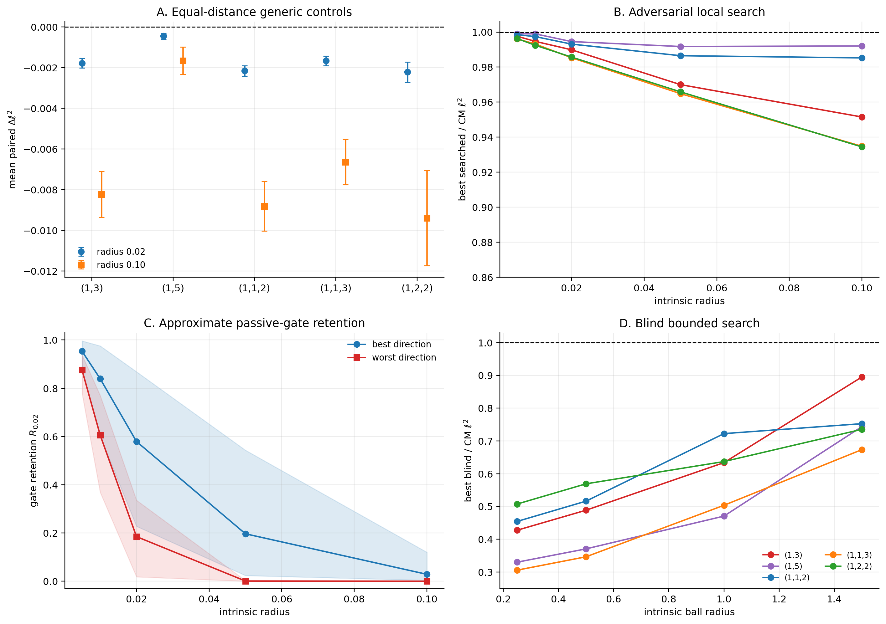

# CM Abelian Varieties, GKP Distance, and Passive Clifford Gates

This workstream tests whether polarized CM abelian varieties occupy
numerically exceptional regions of GKP-code moduli space.

> **Claim.** The experiments provide numerical evidence that CM points are
> enriched near extremal regions for both GKP relative systole and passive
> logical Clifford symmetry. They do **not** prove local or global optimality.



## What is measured

For a polarized abelian variety `(X,L)`, the finite logical Pauli group is

```text
K(L) = ker(phi_L).
```

The relative systole is

```text
ell(X,L) = min { d_X(0,x) : x in K(L), x != 0 }.
```

It is the shortest syndrome-invisible logical displacement. In the paper's
small-isotropic-noise model, larger `ell` gives a better leading logical-error
exponent.

The passive logical Clifford group is the image

```text
image(Aut_0(X,L) -> Sp(K(L))).
```

The automorphism group can be larger than this image because different
geometric automorphisms may induce the same logical action, or act trivially
on `K(L)`.

All raw distance comparisons are made only within a fixed polarization type
`D`. Values from different types are not ranked against one another.

## Headline results

The study covers five nonuniform polarization types:

```text
(1,3), (1,5), (1,1,2), (1,1,3), (1,2,2).
```

| experiment | scale | outcome |
|---|---:|---|
| bounded CM population | 4,165 candidates | enhanced passive symmetry is positively associated with larger `ell^2` in all five types |
| preregistered generic controls | 24,990 deformations | CM baselines have larger local mean `ell^2` in all five types |
| equal-distance controls | 24,990 deformations | all ten type-radius mean changes are negative, with descriptive 95% intervals below zero |
| adversarial local search | 2,400 evaluations | no deformation beats any of the five bounded-CM champions |
| passive-gate robustness | 3,200 evaluations | every nonzero generic deformation loses all exact CM-only actions; approximate retention is direction-dependent |
| blind bounded search | 5,760 evaluations | no blind endpoint beats or ties its Phase-5 population champion, hence none reaches the equal-or-stronger exact CM record known for that type |

At the largest blind-search radius, the comparison is:

| polarization type | best blind `ell^2` | strongest known CM `ell^2` | ratio |
|---|---:|---:|---:|
| `(1,3)` | 0.730918 | 0.816497 | 89.5% |
| `(1,5)` | 0.470379 | 0.632456 | 74.4% |
| `(1,1,2)` | 0.869062 | 1.154701 | 75.3% |
| `(1,1,3)` | 0.777730 | 1.154701 | 67.4% |
| `(1,2,2)` | 0.735415 | 1.000000 | 73.5% |

All 60 blind-search method winners were independently recomputed using a
70-digit finite-kernel CVP calculation. The maximum `ell^2` discrepancy was
`2.3e-16`.

## Evidence ladder

The experiments were designed to remove progressively stronger alternative
explanations.

1. **Exact CM benchmarks.** The automorphism engine reproduces square,
   hexagonal, `D4`/Bolza, and Klein-quartic logical actions.
2. **Matched generic controls.** Generic real symplectic deformations preserve
   dimension, polarization type, and normalization.
3. **Population survey.** Distance and passive-image enhancement are measured
   for 4,165 bounded CM candidates.
4. **Preregistered controls.** Every CM candidate receives fixed local and
   broad controls with hash-derived seeds and no adaptive resampling.
5. **Equal intrinsic distance.** Controls are placed at exactly the same RMS
   affine-invariant radii, removing deformation-scale ambiguity.
6. **Adversarial local search.** Sobol and Gaussian-process optimization search
   the full `g(g+1)`-dimensional compatible tangent sphere.
7. **Gate robustness.** Exact and approximate passive actions are followed
   under the same deformations.
8. **Blind bounded search.** Sobol, CMA-ES, and Bayesian UCB start from the
   canonical product metric determined only by `D`; CM metadata is revealed
   only after all objective calls finish.

The full mathematical and numerical synthesis is in
[docs/consolidated_results.md](docs/consolidated_results.md).

## Claim boundary

The repository does not claim that:

- every CM point is unusually good;
- the bounded CM populations exhaust the CM locus;
- the generic controls provide a canonical probability measure on moduli;
- the finite-budget searches exhaust a noncompact moduli space;
- any sampled CM champion is a proven local or global optimizer;
- CM appears as an independent term in the logical-error asymptotic.

The defensible conclusion is **numerical evidence for CM extremality**, not an
optimality theorem.

## Reproduce

From the repository root:

```bash
python -m pip install -e ".[analysis,dev]"
python -m pip install -e ./passive-cliffords
```

Then:

```bash
cd passive-cliffords
python scripts/generate_consolidated_results.py
python scripts/check_phase1.py
python scripts/check_phase2.py
python scripts/check_phase3.py
python scripts/check_phase4.py
python scripts/check_phase5.py
python scripts/check_phase6.py
python scripts/check_phase7.py
python scripts/check_phase8.py
python scripts/check_phase9.py
python scripts/check_phase10.py
python scripts/check_release.py
```

The stored release ledgers use deterministic `.json.gz` compression where the
plain JSON would be redundant. All loaders and notebooks transparently accept
either form. Regeneration scripts produce plain development JSON.

See [notebooks/README.md](notebooks/README.md) for the executed notebook map and
[data/README.md](data/README.md) for ledger provenance.

## Layout

```text
passive-cliffords/
├── data/       # protocols, summaries, compressed raw ledgers, audits
├── docs/       # phase reports and consolidated interpretation
├── figures/    # publication PNG/PDF figures
├── notebooks/  # executed, deterministic analyses
├── scripts/    # generation, audits, and standalone checks
├── src/        # passive-Clifford and moduli-search implementation
└── tests/      # unit and benchmark tests
```
