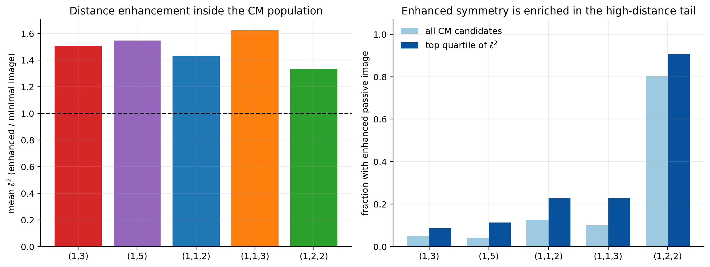
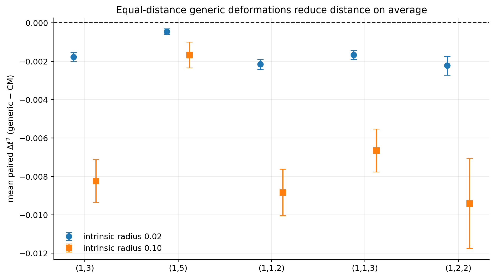
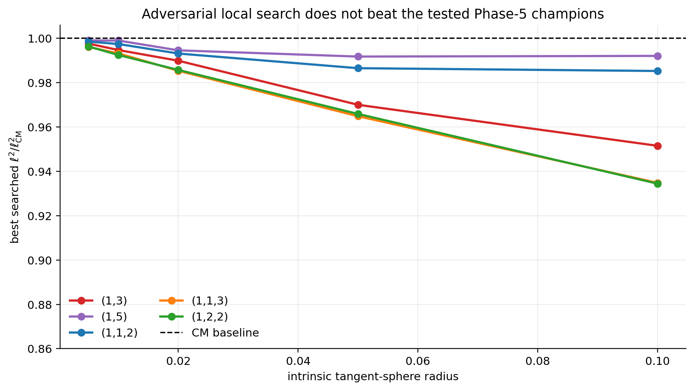
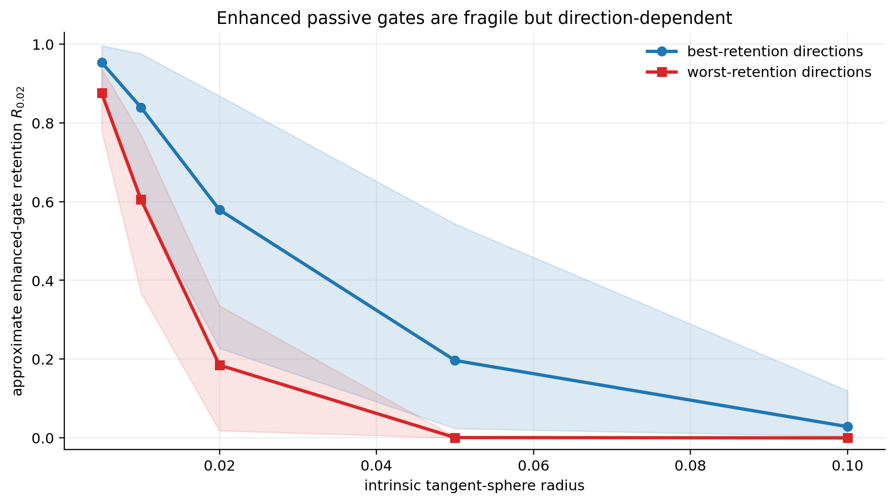
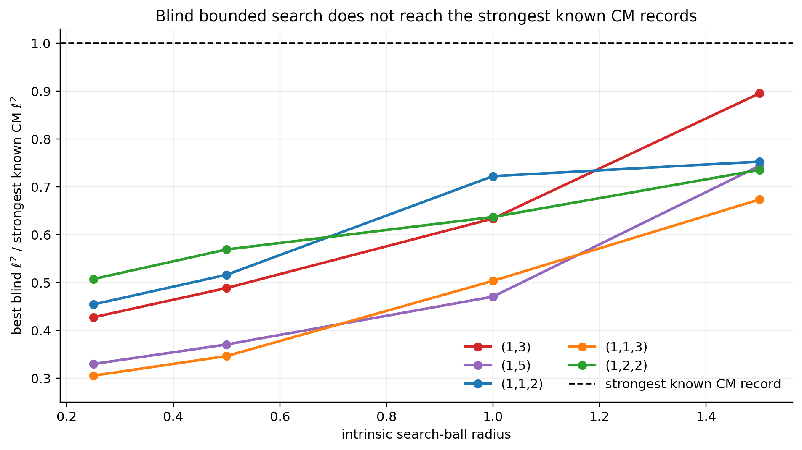

# Consolidated numerical results

## Scope and claim

This report consolidates the numerical study of GKP relative systoles and
passive logical Clifford groups on polarized CM abelian varieties.

The central claim is deliberately limited:

> Across five nonuniform polarization types, the experiments give numerical
> evidence that CM points are enriched near extremal regions for GKP distance
> and passive Clifford symmetry.

No local- or global-optimality theorem is claimed.

## Mathematical quantities

For a polarized abelian variety `(X,L)`, let

```text
phi_L : X -> X-hat
```

be the polarization isogeny. Its finite kernel

```text
K(L) = ker(phi_L)
```

is the logical Pauli group modulo phases. If the polarization has type
`D=(d_1,...,d_g)`, then

```text
K(L) is isomorphic to the direct sum of (Z/d_i Z)^2,
dim H^0(X,L) = product_i d_i.
```

The relative systole is

```text
ell(X,L) = min { d_X(0,x) : 0 != x in K(L) }.
```

It is the shortest displacement that is invisible to the stabilizer syndrome
but nontrivial on the logical system. Under the paper's centered isotropic
small-noise model, the leading logical failure probability is controlled by
`exp(-ell^2/(8 sigma^2))`, up to its multiplicity prefactor.

The origin-fixing polarized automorphism group acts on `K(L)`. Its image

```text
image(Aut_0(X,L) -> Sp(K(L)))
```

counts distinct passive logical Clifford actions modulo Paulis and phases. It
can be strictly smaller than `Aut_0(X,L)` because the action can have a kernel.

## Candidate population

The bounded population contains 4,165 binary and ternary imaginary-quadratic
Hermitian forms:

| type | candidates | enhanced passive image | fraction |
|---|---:|---:|---:|
| `(1,3)` | 876 | 43 | 4.9% |
| `(1,5)` | 915 | 38 | 4.2% |
| `(1,1,2)` | 1,051 | 131 | 12.5% |
| `(1,1,3)` | 1,070 | 106 | 9.9% |
| `(1,2,2)` | 253 | 203 | 80.2% |

This is a bounded computational population, not a complete set of isometry
classes and not a canonical distribution on the CM locus.

Within every type, the mean `ell^2` of the gate-enhanced subgroup exceeds the
mean for candidates with the generic minimal logical image. The ratios are:

| type | mean `ell^2`, enhanced/minimal |
|---|---:|
| `(1,3)` | 1.506 |
| `(1,5)` | 1.546 |
| `(1,1,2)` | 1.431 |
| `(1,1,3)` | 1.623 |
| `(1,2,2)` | 1.335 |

Enhanced images are also more common in the upper distance quartile than in
the full CM population for all five types.



## Matched generic controls

Every CM candidate receives fixed deterministic real symplectic deformations
that preserve the polarization matrix, type, dimension, and volume
normalization. Irrational coefficients make the controls non-CM almost surely,
but their individual endomorphism rings are not all certified.

Phase 6 evaluates 24,990 preregistered local and broad controls. CM baselines
have higher local mean `ell^2` in all five types. A hash-selected gate audit
certifies 233 controls, all having the generic minimal logical image; 17
fixed-time-cap audits remain explicitly unresolved.

Phase 7 removes deformation-scale ambiguity by placing three shared directions
at exactly the same RMS affine-invariant radii, `0.02` and `0.10`. This produces
another 24,990 evaluations. For all ten type-radius comparisons:

- the mean paired change `ell^2_control - ell^2_CM` is negative;
- the descriptive 95% interval lies below zero;
- the decline is larger around CM candidates with enhanced passive images.



These intervals summarize the finite bounded population; they are not
population-sampling confidence intervals for all CM abelian varieties.

## Adversarial local search

The strongest Phase-5 record in each type is searched on five fixed intrinsic
tangent spheres. The full compatible tangent dimension is `g(g+1)`: six for
surfaces and twelve for threefolds.

For each of 25 type-radius searches, equal 64-query budgets compare Sobol with
fixed-kernel Matérn Gaussian-process UCB. Across 2,400 evaluations:

- no deformation beats its CM baseline;
- Bayesian UCB beats the pure Sobol budget in 19 of 25 searches;
- all 25 winners pass independent high-precision CVP audits.



This is stronger than random local sampling but is not exhaustive local
certification.

## Passive-gate robustness

Exact passivity is rigid. For a logical action `a`, define the normalized
metric defect

```text
delta_a(G) = min_{U -> a} || G^(-1/2)(U^T G U - G)G^(-1/2) ||_F / sqrt(2g).
```

The approximate retention score averages `exp(-(delta_a/tau)^2)` over the
CM-only logical actions, with `tau=0.02`.

Across 3,200 nonzero generic deformations:

- every exact CM-only action is lost at tolerance `1e-8`;
- approximate retention depends strongly on deformation direction;
- directions retaining gates tend mildly to retain distance as well rather
  than revealing a strong gate-versus-distance tradeoff.



## Blind bounded search

The strongest control does not start from a CM point. For every type, the
reference is the canonical product metric `diag(D,D)`, determined only by
`D`. The optimizer sees only `ell^2`. CM labels, discriminants, automorphism
orders, and gate data are loaded only after all queries finish.

Four expanding RMS affine-invariant balls have radii

```text
0.25, 0.50, 1.00, 1.50.
```

For every type-radius pair, Sobol, two-restart rank-mu CMA-ES, and Bayesian
UCB receive equal 96-query budgets. The total is 5,760 objective evaluations.

At radius `1.5`:

| type | best blind `ell^2` | strongest known CM `ell^2` | ratio | method |
|---|---:|---:|---:|---|
| `(1,3)` | 0.730918 | 0.816497 | 0.895 | Bayesian UCB |
| `(1,5)` | 0.470379 | 0.632456 | 0.744 | CMA-ES |
| `(1,1,2)` | 0.869062 | 1.154701 | 0.753 | CMA-ES |
| `(1,1,3)` | 0.777730 | 1.154701 | 0.674 | Bayesian UCB |
| `(1,2,2)` | 0.735415 | 1.000000 | 0.735 | Bayesian UCB |

The frozen Phase-10 ledger originally compares against the Phase-5 population
champions. No blind endpoint beats any of those records. The earlier systole
work contains stronger exact CM reconstructions for `(1,5)` and `(1,1,2)`, so
the consolidated table above reports the stricter comparison against the
strongest exact CM record currently known in the repository. CMA-ES supplies
10 of the 20 type-radius winners, Bayesian UCB 9, and Sobol 1. All 60 method
winners agree with 70-digit CVP recomputation to within `2.3e-16` in `ell^2`.



Most radius-1.5 winners lie near the boundary, so the bounded scan has not
saturated. This is evidence that the CM records are not trivial artifacts of
weak generic search, not proof that no stronger non-CM point exists.

## Synthesis

The evidence forms a progression:

```text
population association
  -> matched local controls
  -> exactly equal-distance controls
  -> adversarial local optimization
  -> passive-gate stability analysis
  -> blind bounded optimization.
```

Every stage is consistent with CM points occupying exceptional regions for
both objectives. No stage establishes mathematical optimality.

## Reproducibility and validation

- Seeds are deterministic and protocol-versioned.
- Raw comparisons are made only within fixed `D` and normalization convention.
- Large raw ledgers are tracked as deterministic `.json.gz` files; loaders
  transparently accept compressed or development JSON.
- Phase-specific standalone checks verify counts, invariants, residuals, and
  claim predicates.
- High-performing numerical endpoints receive independent 60- or 70-digit CVP
  audits.
- All public notebooks are executed and contain their validation output.

The machine-readable synthesis is
[`data/consolidated_results.json`](../data/consolidated_results.json).
